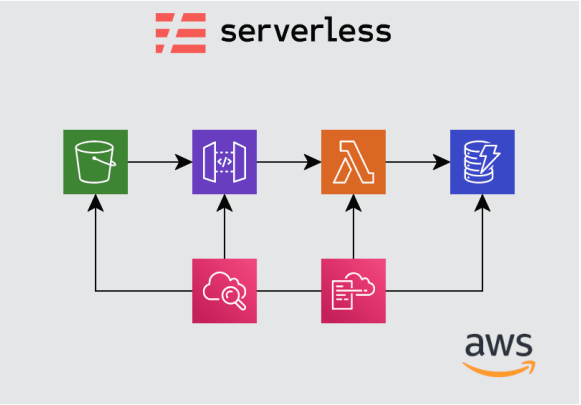

# aws-serverless-demo
This project explains how can we work with API Gateway, Lambda, S3, CloudFormation, DynamoDB using serverless framework

### The Serverless Framework

> The Serverless Framework helps you build serverless apps with radically less overhead and cost. It provides a powerful, unified experience to develop, deploy, test, secure and monitor your serverless applications.

Refer this link: https://serverless.com/


### Installation 

#### **How to install the serverless framework**

**Pre-requesties:**

* node and npm should be installed on your machine.

**Install serverless framework**

```
npm install -g serverless

```

### aws serverless demo using serverless framework

#### aws-serverless-demo architecture




- **Dynamodb**  : For store and retrive the records using key value pairs.
- **Lambda**    :  Run code for virtually any type of application or backend service - all with zero administration.
- **Api Gateway** : Creating, publishing, maintaining, monitoring, and securing REST APIs at any scale.
- **S3 Bucket** : S3 buckets is known to be promising, stable and highly scalable online storage solution.
- **CloudWatch** : For monitoring the logs.
- **CloudFormation**: It helps you model and setup your aws resources with less amount of time

This project has a simple application which store and retrive record from Dynamodb database.

The setup has been made through **serverless framework**

Let see how can we use serverless framework to develop this simple application.

As discussed earlier, we need to install serverless before start the application.

After that, we need to configure your AWS credentials to serverless like this

```
serverless config credentials --provider aws --key <your aws key> --secret <your aws secret key>

```

Lets start to create a new serverless framework project.

I am creating this project in java. We can also create project in nodejs, python etc.

**_Step: 1_**

**Create a folder called account-api**

```
cd account-api

serverless create --template aws-java-maven --name account-api

```


**_Step: 2_**

Open your project in your favourite IDE.

**_Step: 3_**

We need to do slight changes in pom.xml

Change from 

```
  <groupId>com.serverless</groupId>
  <artifactId>hello</artifactId>
  <packaging>jar</packaging>
  <version>dev</version>
  <name>hello</name>

```
to 

```
 <groupId>com.serverless</groupId>
  <artifactId>accounts-api</artifactId>
  <packaging>jar</packaging>
  <version>dev</version>
  <name>accounts-api</name>

```

And we are going to use Dynamodb so we need to add below dependencies

```
  <dependency>
          <groupId>com.amazonaws</groupId>
          <artifactId>aws-java-sdk-dynamodb</artifactId>
          <version>1.11.632</version>
  </dependency>

```

**_Step: 4_**

#### _serverless.yml_

The heart of serverless framework is **_serverless.yml_** file

By using this yml file, you can alot of configuration which specific aws. There are alot. But I am going to use few things in this demo.
For example, I am going to configure dynamodb table, iam role to access dynamodb from lambda, lambda function and API Gateway.

Basically once we run the application, whatever we configured serverless.yml file will be executed with the help of cloudformation. Stack will be created in cloudformation and it will be executing all steps one by one.

Lets see one by one

**1. Change your package information**

```
package:
  artifact: target/hello-dev.jar

functions:
  hello:
    handler: com.serverless.Handler

```
to

```

package:
  artifact: target/accounts-api-dev.jar

functions:
  get-accounts:
    handler: com.serverless.GetAccountsHandler
    events:
      - http:
          path: /accounts/{accountId}/transactions
          method: get
  post-accounts:
    handler: com.serverless.PostAccountsHandler
    events:
      - http:
          path: /accounts/{accountId}/transactions
          method: put

```

Here I am going to use two lambda functions. One for getting account with help of GetAccountsHandler and another one for store account by PostAccountsHandler.

**2. Configure DynamoDB resource**

```
resources:
  Resources:
    transactionsTable:
      Type: AWS::DynamoDB::Table
      Properties:
        TableName: accounts_table
        AttributeDefinitions:
          - AttributeName: account_id
            AttributeType: S
          - AttributeName: account_name
            AttributeType: S
        KeySchema:
          - AttributeName: account_id
            KeyType: HASH
          - AttributeName: account_name
            KeyType: RANGE
        ProvisionedThroughput:
          ReadCapacityUnits: 1
          WriteCapacityUnits: 1

```

**3. Configure IAM role to access dynamodb from Lambda Function**

```
iamRoleStatements:
   - Effect: "Allow"
     Action:
       - "dynamodb:*"
     Resource: "*"

```

**_Step: 5_**

#### **_Lets do the code now_**

Lets finish DynamoDB POJO first

I can created a new package data under com.serverless package.

**_Accounts.java_** - This POJO represents the DynamoDB Item

```
package com.serverless.data;

import com.amazonaws.services.dynamodbv2.datamodeling.DynamoDBHashKey;
import com.amazonaws.services.dynamodbv2.datamodeling.DynamoDBRangeKey;
import com.amazonaws.services.dynamodbv2.datamodeling.DynamoDBTable;

@DynamoDBTable(tableName = "accounts_table")
public class Accounts {

    @DynamoDBHashKey(attributeName = "account_id")
    private String accountId;

    @DynamoDBRangeKey(attributeName = "account_name")
    private String accountName;

    public String getAccountId() {
        return accountId;
    }

    public void setAccountId(String accountId) {
        this.accountId = accountId;
    }

    public String getAccountName() {
        return accountName;
    }

    public void setAccountName(String accountName) {
        this.accountName = accountName;
    }
}

```

Next, Lets create a adapter class to handle all DynamoDb work.

**_DynamoDBAdapter.java_**

```
package com.serverless.data;

import com.amazonaws.client.builder.AwsClientBuilder;
import com.amazonaws.services.dynamodbv2.AmazonDynamoDB;
import com.amazonaws.services.dynamodbv2.AmazonDynamoDBClientBuilder;
import com.amazonaws.services.dynamodbv2.datamodeling.DynamoDBMapper;
import com.amazonaws.services.dynamodbv2.datamodeling.DynamoDBQueryExpression;
import com.amazonaws.services.dynamodbv2.model.AttributeValue;
import org.apache.logging.log4j.LogManager;
import org.apache.logging.log4j.Logger;

import java.io.IOException;
import java.util.HashMap;
import java.util.List;
import java.util.Map;

public class DynamoDBAdapter {

    private Logger logger = LogManager.getLogger(DynamoDBAdapter.class);

    private final static DynamoDBAdapter adapter = new DynamoDBAdapter();

    private final AmazonDynamoDB client;

    private DynamoDBAdapter() {
        client = AmazonDynamoDBClientBuilder.standard().withEndpointConfiguration(
                new AwsClientBuilder.EndpointConfiguration("https://dynamodb.us-east-1.amazonaws.com", "us-east-1"))
                .build();
        logger.info("Created DynamoDB client");
    }

    public static DynamoDBAdapter getInstance() {
        return adapter;
    }

    public List<Accounts> getAccounts(String accountId) throws IOException {
        DynamoDBMapper mapper = new DynamoDBMapper(client);
        Map<String, AttributeValue> vals = new HashMap<>();
        vals.put(":val1", new AttributeValue().withS(accountId));
        DynamoDBQueryExpression<Accounts> queryExpression = new DynamoDBQueryExpression<Accounts>()
                .withKeyConditionExpression("account_id = :val1 ")
                .withExpressionAttributeValues(vals);
        return mapper.query(Accounts.class, queryExpression);
    }


    public void postAccount(Accounts transaction) throws IOException {
        DynamoDBMapper mapper = new DynamoDBMapper(client);
        mapper.save(transaction);
    }

}

```

**_Step: 6_**

#### **_Lets do the Lambda Function Handlers_**

**_PostAccountsHandler.java_**

Here is the code for PostAccountsHandler - handleRequest method

```
    @Override
	public ApiGatewayResponse handleRequest(Map<String, Object> input, Context context) {
			LOG.info("received: " + input);
			//lets get our path parameter for account_id
			try{
				ObjectMapper mapper = new ObjectMapper();
				Map<String,String> pathParameters =  (Map<String,String>)input.get("pathParameters");
				String accountId = pathParameters.get("accountId");
				Accounts tx = new Accounts();
				tx.setAccountId(accountId);
				JsonNode body = mapper.readTree((String) input.get("body"));
				String accountName = body.get("accountName").asText();
				tx.setAccountName(accountName);
				DynamoDBAdapter.getInstance().postAccount(tx);
			} catch(Exception e){
				LOG.error(e,e);
				Response responseBody = new Response("Failure putting transaction", input);
				return ApiGatewayResponse.builder()
						.setStatusCode(500)
						.setObjectBody(responseBody)
						.setHeaders(Collections.singletonMap("X-Powered-By", "AWS Lambda & serverless"))
						.build();
			}
			Response responseBody = new Response("Transaction added successfully!", input);
			return ApiGatewayResponse.builder()
					.setStatusCode(200)
					.setObjectBody(responseBody)
					.setHeaders(Collections.singletonMap("X-Powered-By", "AWS Lambda & serverless"))
					.build();
		}

```

Similarly, we code for GetAccountsHandler - handleRequest Method

**_GetAccountsHandler.java_**

```
    @Override
	public ApiGatewayResponse handleRequest(Map<String, Object> input, Context context) {
			LOG.info("received: " + input);
			List<Accounts> tx;
			try {
				Map<String, String> pathParameters = (Map<String, String>) input.get("pathParameters");
				String accountId = pathParameters.get("accountId");
				LOG.info("Getting transactions for " + accountId);
				tx = DynamoDBAdapter.getInstance().getAccounts(accountId);
			} catch (Exception e) {
				LOG.error(e, e);
				Response responseBody = new Response("Failure getting transactions", input);
				return ApiGatewayResponse.builder()
						.setStatusCode(500)
						.setObjectBody(responseBody)
						.setHeaders(Collections.singletonMap("X-Powered-By", "AWS Lambda & serverless"))
						.build();
			}
			return ApiGatewayResponse.builder()
					.setStatusCode(200)
					.setObjectBody(tx)
					.setHeaders(Collections.singletonMap("X-Powered-By", "AWS Lambda & serverless"))
					.build();
		}

```

We done our coding part. Lets do the deploy.

**_Step: 7_**

#### **_Lets deploy the lambda functions_**

First do, mvn clean install


Next run the below command from your project directory

```
serverless deploy

```